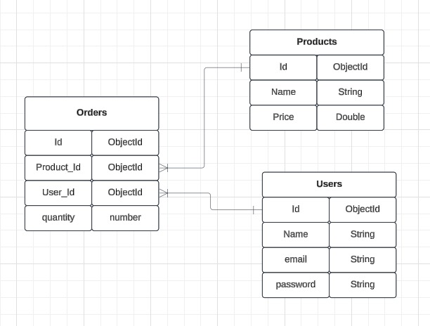

### Online Store
This project is a simple backend for an online store application, built with Node.js and MongoDB. It includes authentication, product management, and order handling functionality.

Prerequisites
Before running the project, ensure you have the following installed on your machine:

Node.js
MongoDB
Also, make sure that MongoDB is running locally.

Installation
Clone the repository to your local machine:

bash
```
git clone https://github.com/AikaBe/nosql-final.git
```
Navigate to the project directory:

bash
```
cd nosql-final
```
Install the dependencies:

bash
```
npm init -y
npm install express mongoose bcryptjs jsonwebtoken body-parser path
```
Running the Application
To run the application, use the following command:

bash
```
node app.js
```
The application will start on port 3000. You can access the API endpoints via http://localhost:3000.

### CRUD 
# C - create order 
# R - read all the products which is alredy have in db
# U - update order by ID
# D - delete order by ID

### External API Data Collection
This project includes a separate Go file (data_collection.go) for collecting data from an external API. You can run it to gather data for the application, if needed. The file is meant to be executed in a Go environment, and it will automatically gather and store necessary data.

Running the Data Collection Script
To run the data collection script, make sure you have Go installed on your machine. Then, execute the following command in the project directory:

bash
```
go run data_collection.go
```
This will collect the required data from an external API and process it accordingly.

### Deployment 
# Render
https://nosql-final-3.onrender.com

### open source API for products
https://fakestoreapi.com/products

### ERD diagram


